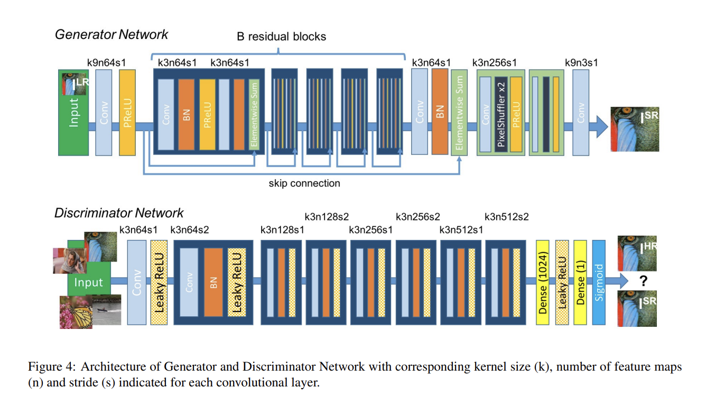

# SRGAN-from-scratch

My implementation of the model from the paper "Photo-Realistic Single Image Super-Resolution Using a Generative Adversarial
Network"



I trained the model on the [DIV2K-dataset](https://data.vision.ee.ethz.ch/cvl/DIV2K/)

Instal dependencies:
```
pip install -r requirements.txt
```
To train using your custom dataset:\
Clone the repository:
```
git clone https://github.com/pbcong/SRGAN-from-scratch
```
Train using [train-notebook](training-notebook.ipynb) or run [train.py](train.py)

Pretrained models:
- With VGG19 and MSE only: [Here](https://drive.google.com/drive/folders/18rHSCkWbE960EdbuKbWEKBqRzcNPi8i8?usp=drive_link) 
- SRGAN: [Here](https://drive.google.com/drive/folders/1SWztSpHaQTUlpgCMTEhCjkF7ub3IdkP0?usp=drive_link) 

Results:\

